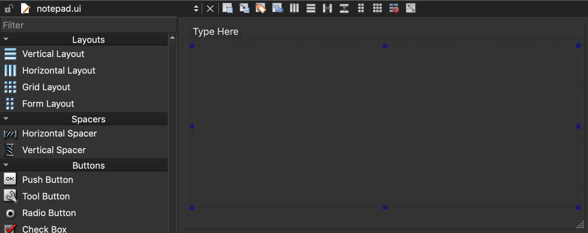
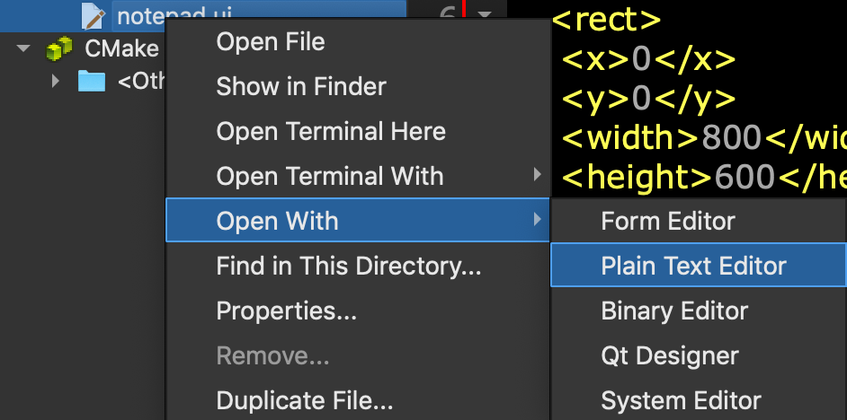

# The 1st Project : Notepad

- 참고 : [Getting Started Programming with Qt Widgets](https://doc.qt.io/qt-5/qtwidgets-tutorials-notepad-example.html#using-qt-designer)

### Create a project

- **File** > **New File or Project** > **Applications** > **Qt Widgets Application** > **Choose**
- **Class Information** 창에서, 클래스명에 **Notepad**를  베이스 클래스는 **QMainWindow을 선택한다.
- 빌드는 CMake를 선택하고, 완료한다.


### Source Files

> notepad.pro - 프로젝트 파일
>
> main.cpp - 어플리케이션의 메인 파일
>
> notepad.cpp - Notepad 위젯의 Nodepad 클래스 소스 파일
>
> notepad.h - Notepad 위젯의 Nodepad 클래스 헤더 파일 ; QMainWindow를 상속한다.
>
> notepad.ui - Notepad 위젯의 UI Form ; XML 포멧 파일, 클릭하면 Qt Designer 환경이 활성화된다.


### Main Source

: main.cpp

```C++
#include "notepad.h"
#include <QApplication>
int main(int argc, char *argv[]) {
    QApplication a(argc, argv);
    Notepad w;
    w.show();
    return a.exec();
}
```

- QApplication
  - QApplication 오브젝트는 어플리케이션 전반의 리소스를 관리한다.
  - Qt Widget을 사용하는 Qt 프로그램을 구동하기 위해 필요하다.
  - Qt Widget을 사용하지 않는 경우, [QGuiApplication](https://doc.qt.io/qt-5/qguiapplication.html) 클래스를 사용한다.
- `Notepad.show()`를 하지 않으면 화면에 아무것도 보이지 않는다.


> Qt에서 Widget은 다른 Widget의 컨테이너 역할을 할 수 있다.
>
> 대표적으로 다이얼로그나 메인윈도우 역시 Widget이고 동시에 다른 Widget을 담을 수 있는 컨테이너다.
>
> 예제에서 메인윈도우의 `Notepad` 역시 다른 Widget을 담는 컨테이너다.


- `QApplication.exec()`가 실행되면 QApplication은 `Event Loop` 상태로 진입한다.
  - 어플리케이션이 실행 중이면 어플리케이션에 포함된 Widget들에게 발생한 이벤트가 전달된다.


### Qt Designer

- `notepad.ui`파일은 XML 포멧으로 작성하는 UI 정의 문서다.

- Qt Creator에서 이 파일을 열면 Qt Designer 화면이 활성화된다.

  

- `notepad.ui` 파일의 XML 내용을 보려면 **Right Click > Open With > Plain Text Editor**를 선택한다.

  


### UI Files

- `notepad.h`, `notepad.cpp`는 UI File이다.

##### Header

```C++
#ifndef NOTEPAD_H
#define NOTEPAD_H
#include <QMainWindow>
QT_BEGIN_NAMESPACE
namespace Ui { class Notepad; }
QT_END_NAMESPACE

class Notepad : public QMainWindow {
    Q_OBJECT
public:
    Notepad(QWidget *parent = nullptr);
    ~Notepad();
private:
    Ui::Notepad *ui;
};
#endif // NOTEPAD_H
```

- `#include <QMainWindow>`를 통해 메인 윈도우를 포함시킨다.
- `Q_OBJECT` 매크로는 클래스를 정의할 때 가장 윗쪽에 선언해야한다.
- 


##### Source

```C++
#include "notepad.h"
#include "./ui_notepad.h"
Notepad::Notepad(QWidget *parent)
    : QMainWindow(parent)
    , ui(new Ui::Notepad) {
    ui->setupUi(this);
    this->menuBar()->setNativeMenuBar(false);
}
Notepad::~Notepad() {
    delete ui;
}

```

- masOS에서 메뉴를 추가해도 화면에 나타나지 않는 문제가 있다.
  - `this->menuBar()->setNativeMenuBar(false);`를 추가해서 네이티브 메뉴바를 비활성시키면 Qt메뉴가 활성화된다.


