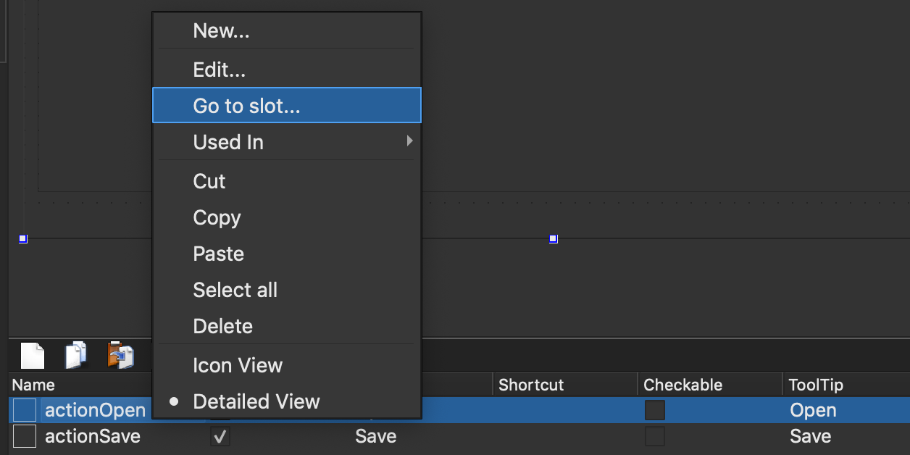

# The 1st Project : Notepad

- 참고 : [Getting Started Programming with Qt Widgets](https://doc.qt.io/qt-5/qtwidgets-tutorials-notepad-example.html#using-qt-designer)
-  Notepad 전체 소스(공식사이트) : [notepad](https://code.qt.io/cgit/qt/qtbase.git/tree/examples/widgets/tutorials/notepad?h=5.14)


## Create a project

- **File** > **New File or Project** > **Applications** > **Qt Widgets Application** > **Choose**
- **Class Information** 창에서, 클래스명에 **Notepad**를  베이스 클래스는 **QMainWindow을 선택한다.
- 빌드는 CMake를 선택하고, 완료한다.


## Source Files

> notepad.pro - 프로젝트 파일
>
> main.cpp - 어플리케이션의 메인 파일
>
> notepad.cpp - Notepad 위젯의 Nodepad 클래스 소스 파일
>
> notepad.h - Notepad 위젯의 Nodepad 클래스 헤더 파일 ; QMainWindow를 상속한다.
>
> notepad.ui - Notepad 위젯의 UI Form ; XML 포멧 파일, 클릭하면 Qt Designer 환경이 활성화된다.


## Main Source

: main.cpp

```C++
#include "notepad.h"
#include <QApplication>
int main(int argc, char *argv[]) {
    QApplication a(argc, argv);
    Notepad w;
    w.show();
    return a.exec();
}
```

- QApplication
  - QApplication 오브젝트는 어플리케이션 전반의 리소스를 관리한다.
  - Qt Widget을 사용하는 Qt 프로그램을 구동하기 위해 필요하다.
  - Qt Widget을 사용하지 않는 경우, [QGuiApplication](https://doc.qt.io/qt-5/qguiapplication.html) 클래스를 사용한다.
- `Notepad.show()`를 하지 않으면 화면에 아무것도 보이지 않는다.


> Qt에서 Widget은 다른 Widget의 컨테이너 역할을 할 수 있다.
>
> 대표적으로 다이얼로그나 메인윈도우 역시 Widget이고 동시에 다른 Widget을 담을 수 있는 컨테이너다.
>
> 예제에서 메인윈도우의 `Notepad` 역시 다른 Widget을 담는 컨테이너다.


- `QApplication.exec()`가 실행되면 QApplication은 `Event Loop` 상태로 진입한다.
  - 어플리케이션이 실행 중이면 어플리케이션에 포함된 Widget들에게 발생한 이벤트가 전달된다.


## Qt Designer

- `notepad.ui`파일은 XML 포멧으로 작성하는 UI 정의 문서다.

- Qt Creator에서 이 파일을 열면 Qt Designer 화면이 활성화된다.

  

- `notepad.ui` 파일의 XML 내용을 보려면 **Right Click > Open With > Plain Text Editor**를 선택한다.

  


## UI Files

- `notepad.h`, `notepad.cpp`는 UI File이다.

##### Header

```C++
#ifndef NOTEPAD_H
#define NOTEPAD_H
#include <QMainWindow>
QT_BEGIN_NAMESPACE
namespace Ui { class Notepad; }
QT_END_NAMESPACE

class Notepad : public QMainWindow {
    Q_OBJECT
public:
    Notepad(QWidget *parent = nullptr);
    ~Notepad();
private:
    Ui::Notepad *ui;
};
#endif // NOTEPAD_H
```

- `#include <QMainWindow>`를 통해 메인 윈도우를 포함시킨다.
- `Q_OBJECT` 매크로는 클래스를 정의할 때 가장 윗쪽에 선언해야한다.
- 


##### Source

```C++
#include "notepad.h"
#include "./ui_notepad.h"
Notepad::Notepad(QWidget *parent)
    : QMainWindow(parent)
    , ui(new Ui::Notepad) {
    ui->setupUi(this);
    this->setCentralWidget(ui->textEdit);
    this->menuBar()->setNativeMenuBar(false);
}
Notepad::~Notepad() {
    delete ui;
}

```

- masOS에서 메뉴를 추가해도 화면에 나타나지 않는 문제가 있다.
  - `this->menuBar()->setNativeMenuBar(false);`
    -  네이티브 메뉴바를 비활성시키면 Qt메뉴가 활성화된다.
    - 이 코드가 없으면 macOS 스타일로 모니터 최상단의 메뉴에 나타난다.
  - `this->setCentralWidget(ui->textEdit);`
    - Text Edit가 윈도우 전체를 차지하도록 설정한다.


## Connect UI Elements to Codes

##### 메뉴추가


##### UI요소를 코드와 연결하기 : Trigger

- Qt Designer 하단에 Action Editor가 있다.
- Open을 클릭했을 때, 어떤 함수가 호출되도록 한다.
  - G**o to Slot > Triggered**를 선택하면 코드에 자동으로 함수가 추가된다.




```C++
void Notepad::on_actionOpen_triggered() {
    qDebug("on_actionOpen_triggered");
}

void Notepad::on_actionSave_triggered() {
    qDebug( "on_actionSave_triggered");
}
```

- 실행하고 메뉴를 클릭하면, 디버그 메시지가 출력된다.

- `qDebug("...");`
  - Qt에서는 printf 대신 `qDebug`함수를 사용한다.


## Resources

##### 

##### qrc 파일 추가

1. Qt Creator 화면 좌측 해당 프로젝트 우클릭
2. `Add New...`
3. `Qt`  > `Qt Resource File` (*.prc) 선택


4. Choose...
5. 파일명에 `resources` 입력
   - 파일명이 `resources.qrc`로 생성된다. (파일명은 자유)
6. 프로젝트 root 폴더 밑에 `resources` 폴더 생성 (폴더명 역시 자유) 및 폴더 선택 후 `Next`
7. 아래 화면에서 내용 확인 후 `Finish`


##### 

##### Image File 추가

1. `[ROOT]/resources/` 하위에 `img` 폴더 생성
2. 프로젝트에서 사용할 이미지 파일을 복사해 넣는다.
3. `Add New...` > `Add Existing Files...`
4. 추가할 이미지를 선택한 후, `Open`
5. 아래와 같이 폴더명과 함께 이미지 경로가 설정되어 추가된다.


6. `Prefix`를 사용하면 한 폴더에 있는 이미지들을 추가로 구분할 수 있다.

   - 개인적으로는 파일명에 직접 붙이는 것이 좋아서 사용하지 않았다.

   

##### QSS File 추가

1. ` [ROOT]/resources/` 하위에 `qss` 폴더 생성
2. `qss`폴더에 `style_default.qss` 파일 생성
3. `Add Files` > `style_default.qss` 선택


4. `mainwindow.cpp`의 생성자에서 `qss`파일을 등록한다.

```c++
MainWindow::MainWindow(QWidget* parent)
  : QMainWindow(parent)
  , ui_(new Ui::MainWindow) {
	...
	// QSS install
	QFile file(":/qss/style_default.qss");
	file.open(QFile::ReadOnly);
	qApp->setStyleSheet(QString::fromLatin1(file.readAll()));
    ...
}
```


##### 한글지원 처리

##### 

##### 

- 한글명칭의 파일이나 경로를 읽고 UI에 반영할 때 한글이 깨지는 경우, 아래 코드를 `main.cpp`에서 호출한다.

```C++
void SetLanguage() {
  std::locale::global ( std::locale("") );
  QTranslator qtTranslator;
  qtTranslator.load("qt_" + QLocale::system().name(),
                    QLibraryInfo::location(QLibraryInfo::TranslationsPath));
  qApp->installTranslator(&qtTranslator);
  QTranslator myappTranslator;
  myappTranslator.load("myapp_" + QLocale::system().name());
  qApp->installTranslator(&myappTranslator);
}
```

