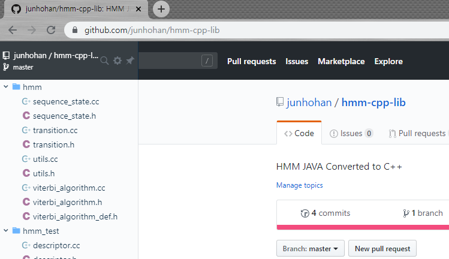
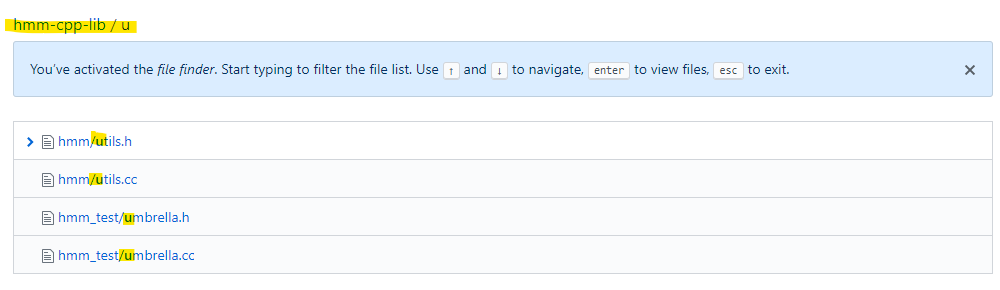

# Github Tips

### Octotree 
- Chrome App
- Repository에 들어가면 왼쪽에 버튼이 활성
- 트리구조의 소스 리스트를 제공
- 소스검색 및 리뷰가 용이함
- Pro 버전은 구독 서비스, 약3만원/year)



### Shortcuts
- Repository에서 [t.T]를 누르면 파일 검색이 가능



### 웹에서 History 쉽게 보기

- URL에서 ***github-history.netlify.com***으로 변경하여 히스토리를 쉽게 볼 수 있는 페이지로 이동

From 
```
https://github.com/SOMEONE/FOLDER/my_file.md
```
To
```
https://github-history.netlify.com/SOMEONE/FOLDER/my_file.md
```

# Git Tips

### Install Git

on Mac
```
$ brew install git
```

on Ubuntu
```
$ sudo apt-get install git-all  
```

### Configure Git
```
$ git config --global user.name "zzuwie"  
$ git config --global user.email "zzuwie@twice.com"  
```

### Source download
```
$ git clone https://github.com/youe_repo/twice.git
```
  "--recursive" : clone and initialize all submodules
  "--depth 1" : Revision 1개(depth)까지의 history만 다운로드함 (다운로드 사이즈 감소)

### Pull (Fetch & Merge)
```
$ git pull origin develop  
```

### Switch to Branch("develop")
```
$ git checkout develop  
```

### Branch

Show Local Repo. Branches
```
$ git branch
```

  "-a" : Show all the local and remote branches  
  "-vv" : Show branches in detail
  "-d [BRANCH_NAME]" : Delete Branch (equals to "--delete")
  "-D [BRANCH_NAME]" : equals to "--delete --force"

Create Branch Locally
```
$ git checkout -b develop
```

### Check status
```
$ git status  
```

### Add index
```
$ git add .  
```

### Commit to local Repo.
```
$ git commit -m "YOUR_COMMENTS_ABOUT_MODIFICATION"  
```

### Upload to specified branch on Remote Repo.
```
$ git push origin develop  
```

### Remove directory
```
$ git rm -r build_ubuntu  
```

### Remove file
```
$ git rm ./src/foo/foo.c  
```

### Merge BRANCH to MASTER(Remote)
```
$ git checkout master  
$ git pull origin master  
$ git merge develop  
$ git push origin master  
```

### Create Tag
```
$ git tag v0.0.1  
```

### Push Tag to Remote

```
$ git push --tags  
```

### Submodule
프로젝트에 외부 소스가 연결된 경우, submodule를 모두 다운로드 받아야 빌드가 가능함

```
$ git submodule init  
$ git submodule update  
```

모든 Submodule 전체 업데이트

```
$ git pull --recurse-submodules
$ git submodule update --recursive --remote
```

### Git Diagram

  


# Git-FLow
### Init git-flow
Working directory에서 git flow를 사용하려면 최초 1회 실행한다

```
$ git flow init
```

### Start new feature
기능을 추가(개발)할 때, 새로운 브랜치를 생성한다
```
$ git flow feature start add_func
```
* 실행하면...
  - 새로운 브랜치(feature/add_func) 생성 (Base Branch는 develop)
  - 현재 디렉토리는 "feature/add_func" 브랜치와 연결됨

### Feature 공동 개발
기능 추가를 여럿이서 할 경우, Local Repo.에 생성한 브랜치를 remote에 push해야 함
```
$ git push --set-upstream origin feature/add_func
```

* 실행하면...
  - Local Repo.에만 생성되었던, feature/add_func 브랜치를 Remote에 업로드

### Finish Featuring
```
$ git flow feature finish add_func
```

* 실행하면...
  - 변경 내용이 Base Branch(develop)로 merge됨
  - "feature/add_func" 삭제
  - 현재 디렉토리는 "develop" 브랜치와 연결됨

### 개발한 내용 Publish하기
feature 브랜치가 remote에 push된 경우에 사용 가능
```
$ git flow feature publish add_func
```

### 타인이 개발한 내용을 내려받기
feature 브랜치가 remote에 push된 경우에 사용 가능
```
$ git flow feature pull origin add_func
```

### Remote Branch 삭제
```
$ git push origin :BRANCH_NAME
```

# Trouble Shoot
### Remove Submodule
```$ROOT/.gitmodules``` 파일에서 제거할 submodule내용을 삭제한다.

```
$ cd MY_PRJ
$ vim .gitmodules

[submodule "3rd"]
  path = 3rd
  url = https://github.com/youe_repo/3rd.git
```

```
$ vim .git/config

[submodule "3rd"]
  url = https://github.com/youe_repo/3rd.git
```

```
rm -rf .git/modules/3rd
```

Stage the .gitmodules changes via command line using:git add .gitmodules
Delete the relevant section from .git/config, which will look like:
[submodule "vendor"]
	url = git://github.com/some-user/some-repo.git
Run git rm --cached path/to/submodule .  Don't include a trailing slash -- that will lead to an error.
Run rm -rf .git/modules/submodule_name
Commit the change:
Delete the now untracked submodule files rm -rf path/to/submodule

# Trouble Shootings
### 실수로 삭제한 후 파일 복구하기

```
$ git ls-files -d | xargs git checkout --
```
