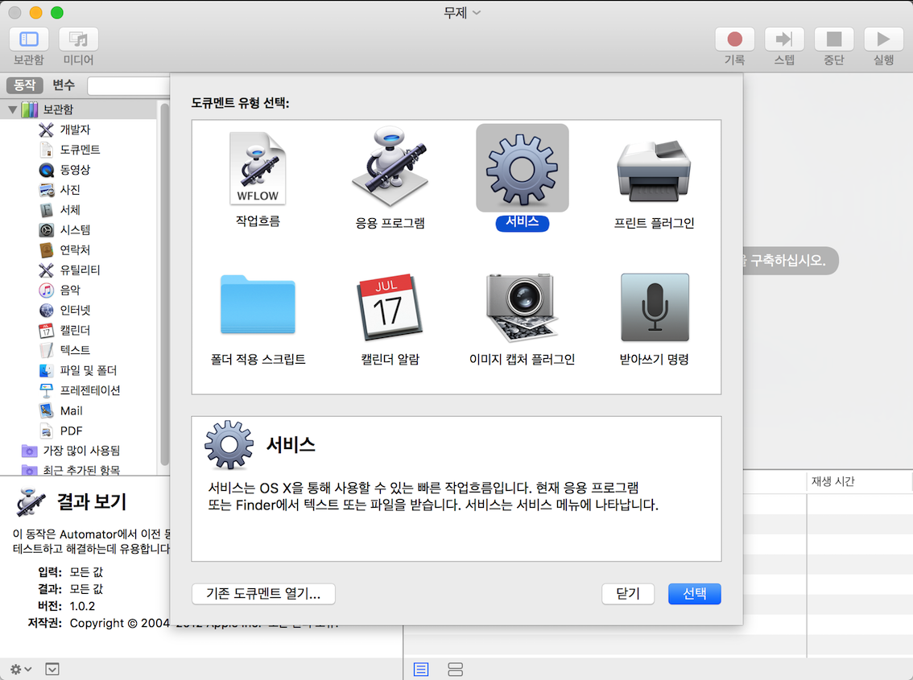
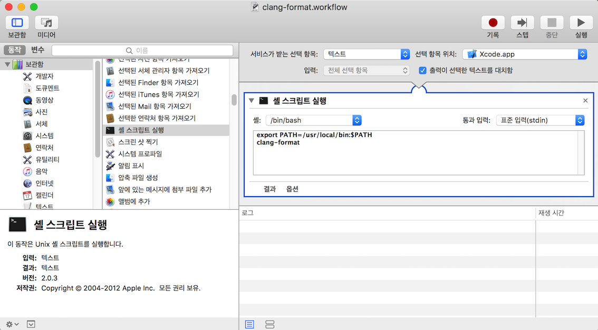
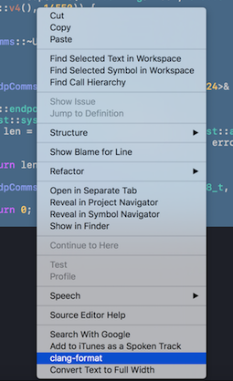

# xcode

## C++ Formatter 설치 및 사용하기

* clang-format 설치

  ```Bash
    $ brew install clang-format
  ```

* macos의 Launchpad 실행  
* Automator 실행  



* 보관함(Library) 하위 리스트에서 [셸 스크립트 실행] Double Click  



* [출력이 선택한 텍스트를 대체함] 체크  
* 스크립트 입력창에 아래 내용을 입력  

```Bash
  export PATH=/usr/local/bin:$PATH
  clang-format
```

* `command + s` 로 저장
  `/Users/USER_NAME/Library/Services/clang-format.workflow` 에 저장됨
* 사용자 최상위 디렉토리에 `~/.clang-format` 파일을 생성
* `.clang-format` 파일을 수정하면 100여개의 옵션을 설정할 수 있다.  
* `clang-format`이 지원하는 Option [자세히 알아보기](http://releases.llvm.org/3.6.0/tools/clang/docs/ClangFormatStyleOptions.html)
* example

```Bash
  # We’ll use defaults from the Google C++ Code Convention style                  
  BasedOnStyle: Google                                                            
  ColumnLimit: 80                                                                 
  IndentWidth: 2                                                                  
  TabWidth: 4                                                                     
  UseTab: Never   
```

기본 Code Style은 `BasedOnStyle`으로 지정하고 Google Style Guide를 설정하려면 `BasedOnStyle: Google`와 같이 입력한다.

지원하는 Code Convention
  > `LLVM` : [LLVM coding standards](http://llvm.org/docs/CodingStandards.html)  
  > `Google` : [Google’s C++ style guide](https://google.github.io/styleguide/cppguide.html)  
  > `Chromium` : [Chromium’s style guide](https://chromium.googlesource.com/chromium/src/+/master/styleguide/c++/c++.md)  
  > `Mozilla` : [Mozilla’s style guide](https://developer.mozilla.org/en-US/docs/Mozilla/Developer_guide/Coding_Style)  
  > `WebKit` : [WebKit’s style guide](https://webkit.org/code-style-guidelines/)  
  


이제 xcode를 실행(재실행하지 않아도 됨)하고 포멧을 적용할 코드를 드래그한 후, 우클릭을 한 뒤, `clang-format`을 선택하면 코드가 예쁘게 정리된다.




